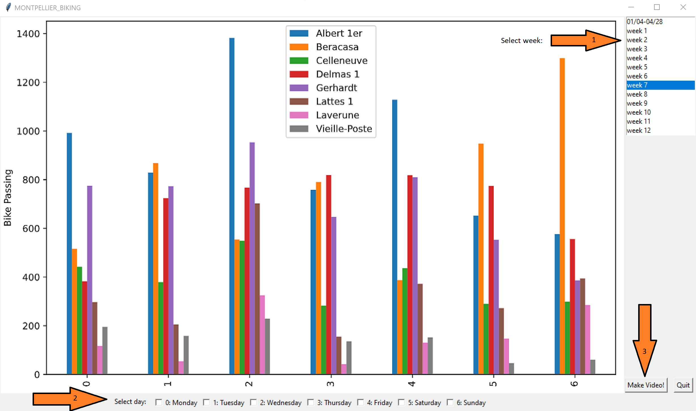

# Group project "Montpellier biking network simulation"

## Group members :
 * Alleau Julie : julie.alleau@etu.umontpellier.fr 
 * Chaoui Wiam : wiam.chaoui@etu.umontpellier.fr
 * Poncheele Clement : clement.poncheele@etu.umontpellier.fr
 * Seck, Gade : gade.seck@etu.umontpellier.fr

## Description  :

The end goal of this project is to create a Python module (that can be imported with pip) that is able to produce videos of the flow in the city of Montpellier during a whole week .

## Installation :

    $ pip install montpellier-biking

## How to use it:

Way 1:

    >>> import montpellier_biking as mb
    >>> mb.program.Application()

Way 2:

    $ program.py

## Other
### Tasks distribution (mid time) :

* Data processing -> Clement et Julie 
* Creation of a module that will allow traffic modeling : -> Clement ,Julie et Gade 
    - Bicycles 
    - The roads
    - Bicycle routes (Random) 
* The traffic's visualization  -> Clement ,Julie et Wiam
* pep8/Documentation -> Everybody 
* Tests -> Gade et Wiam

## Video presentation

You can find it in the images_video folder.

